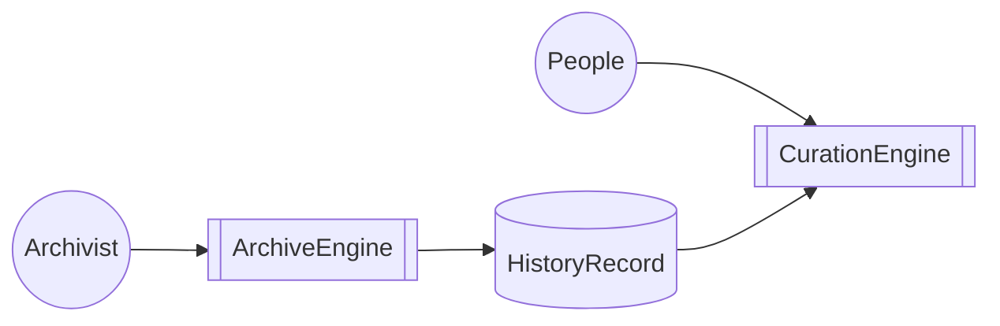

# システム構造

```mermaid
flowchart LR
  P((People)) --> CE[[CurationEngine]]
  A((Archivist)) --> AE[[ArchiveEngine]]
  AE --> HR[(HistoryRecord)]
  HR --> CE
```

## HistoryRecord

あらゆる事象を記録するためのデータベース

## CurationEngine

HistoryRecordに入っている情報を人が見やすい形で提供するためのシステム

## ArchiveEngine

あらゆる事象をHistoryRecordに記録するためのシステム

