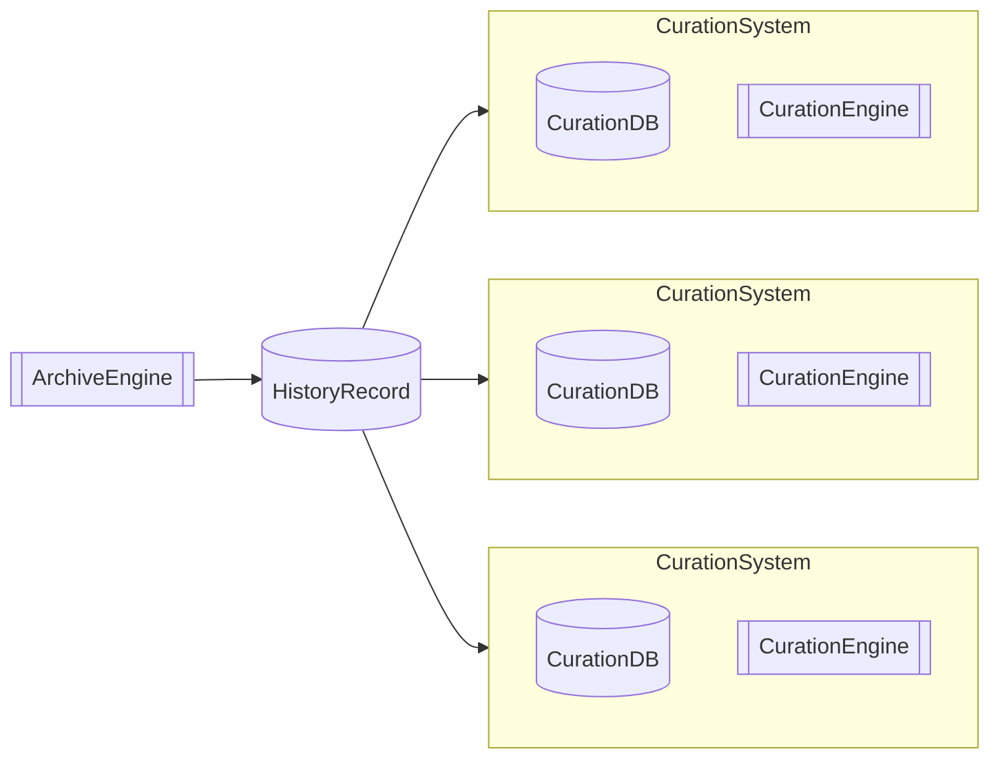
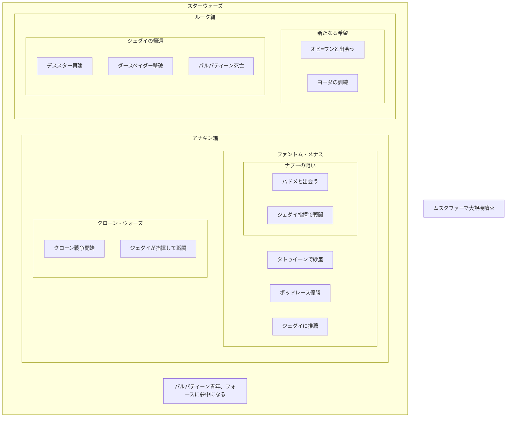

# システム構造

## HistoryRecord

あらゆる歴史的事象を記録するためのデータベース

### 基本データ構造

#### scene

いつ、どこで、何が、何をしたかを記録するもの

- 22 BBY、惑星ナブーで、アナキンがパドメと結婚した
- 4 ABY、皇帝パルパティーンの玉座の間で、ルークがダースベイダーを倒した
- 0 BBY、オルデラン星系で、デススターが惑星オルデランを破壊した
- 32 BBY、タトゥイーンで、砂嵐が起きた
- 33 BBY、ナブーの戦いを知った少年たちはひどいショックを受けた。

#### series

sceneをまとめたもの。seriesの中にseriesが入ることもある。単一のsceneが複数のseriesに入ることもある。

#### cast

sceneの事象を引き起こすありとあらゆるもの。
sceneやseriesもcastとしての役割を果たすことがある。

- オビ=ワン=ケノービ
- デススター
- ジェダイ
- ムスタファー
- ポッドレース
- ナブー
- ライトセーバー
- 砂嵐
- タトゥイーン
- フォース
- クローン戦争
- ナブーの戦い

などなど

## CurationSystem

HistoryRecordに入っている情報を目的に応じて提供するためのアプリケーションおよびデータベース

## ArchiveEngine

HistoryRecordに記録するためのアプリケーション

