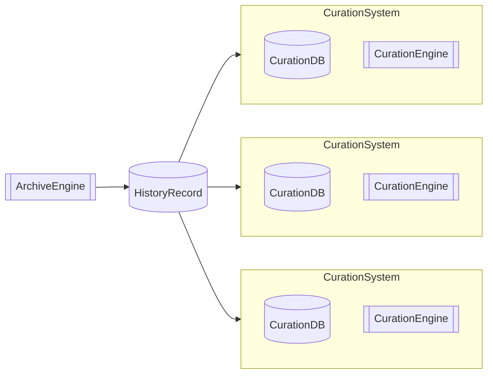
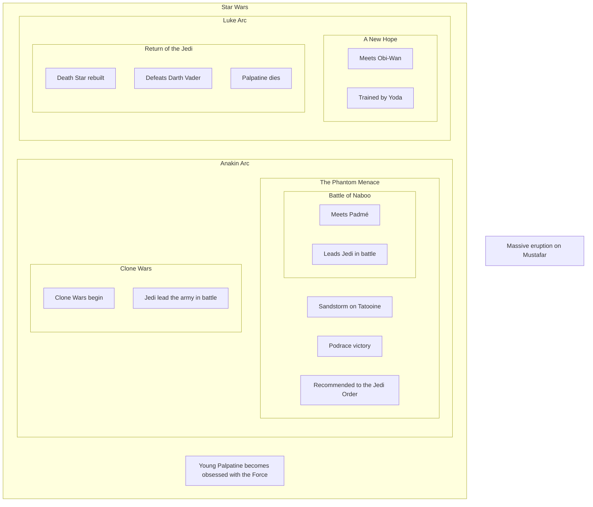
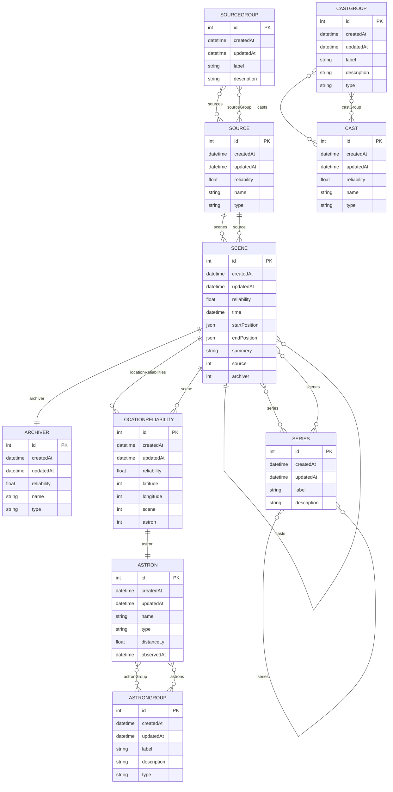

# System Architecture

## HistoryRecord

A database designed to record all historical events.

### Basic Data Structure

#### scene

A unit that records when, where, who, and what happened.

- 22 BBY: Anakin married Padmé on the planet Naboo
- 4 ABY: Luke defeated Darth Vader in Emperor Palpatine’s throne room
- 0 BBY: The Death Star destroyed the planet Alderaan in the Alderaan system
- 32 BBY: A sandstorm occurred on Tatooine
- 33 BBY: Children who learned about the Battle of Naboo were deeply shocked

#### series

A collection of scenes.
A series can contain other series, and a single scene may belong to multiple series.

#### cast

Any entity that causes or participates in events within a scene.
Scenes and series themselves can also act as cast.

- Obi-Wan Kenobi
- Death Star
- Jedi
- Mustafar
- Podrace
- Naboo
- Lightsaber
- Sandstorm
- Tatooine
- The Force
- Clone Wars
- Battle of Naboo

etc.

### Detailed Data Structure

(2026.4.30) Generated from an ORM entity. I’ll check the output later.

## CurationSystem

An application and database that provide information stored in the HistoryRecord based on specific purposes.
## ArchiveEngine

An application responsible for recording data into the HistoryRecord.

