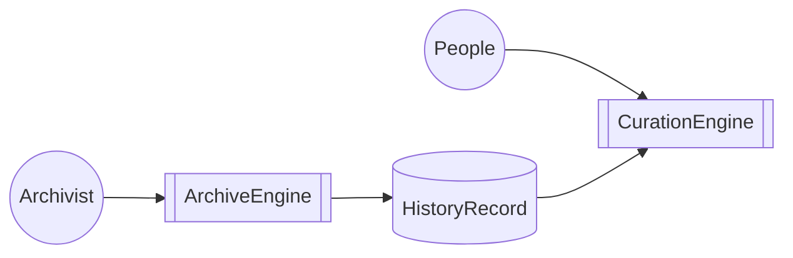
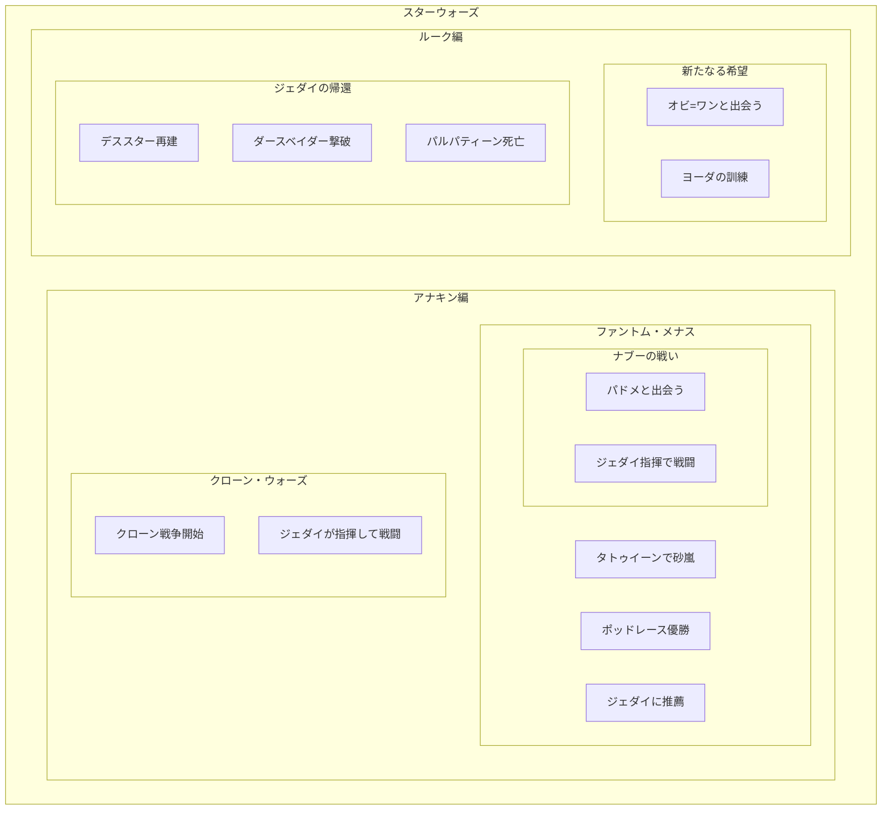

# システム構造

## HistoryRecord

あらゆる歴史的事象を記録するためのデータベース

### 基本データ構造

#### scene

いつ、どこで、何が、何をしたかを記録するもの

- 22 BBY、惑星ナブーで、アナキンがパドメと結婚した
- 4 ABY、皇帝パルパティーンの玉座の間で、ルークがダースベイダーを倒した
- 0 BBY、オルデラン星系で、デススターが惑星オルデランを破壊した
- 32 BBY、タトゥイーンで、砂嵐が起きた

#### series

sceneをまとめたもの。seriesの中にseriesが入ることもある。

#### cast

## CurationEngine

HistoryRecordに入っている情報を人が見やすい形で提供するためのシステム

## ArchiveEngine

あらゆる事象をHistoryRecordに記録するためのシステム

