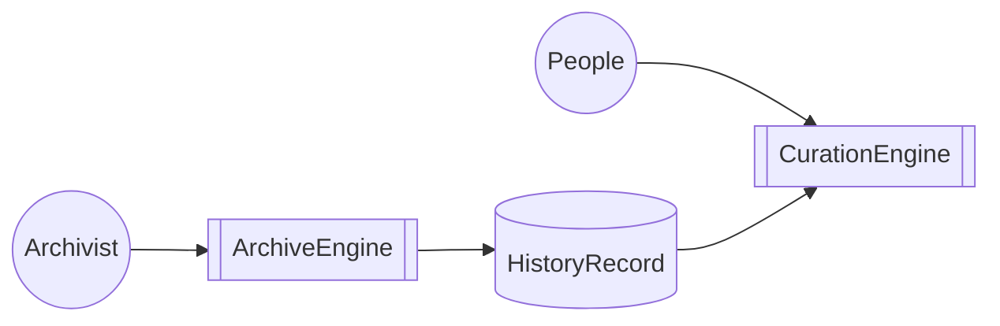

# システム構造



## HistoryRecord

あらゆる歴史的事象を記録するためのデータベース

### 基本データ構造

#### scene

いつ、どこで、何が、何をしたかを記録するもの

- 22 BBY、惑星ナブーで、アナキンがパドメと結婚した
- 4 ABY、皇帝パルパティーンの玉座の間で、ルークがダースベイダーを倒した
- 0 BBY、オルデラン星系で、デススターが惑星オルデランを破壊した
- 32 BBY、タトゥイーンで、砂嵐が起きた

#### series

sceneをまとめたもの。seriesの中にseriesが入ることもある。

- スターウォーズ
    - アナキン編
        - ファントム・メナス
            ```
          タトゥイーンで、砂嵐が起きた  
          ポッドレースで、アナキンが優勝した  
          クワイ=ガン・ジンがアナキンをジェダイに推薦した
            ```
            - ナブーの戦い
               ```
              通商連合に交渉人として派遣されたクワイ=ガン・ジンが、ナブーの女王パドメと出会った
               クワイ=ガン・ジンが、ナブーの戦いでジェダイを指揮して、ドロイド軍と戦った
              ```

        - クローン・ウォーズ
            ```
          コルサントで、クローン戦争が始まった  
          ジェダイがクローン軍を指揮して、分離主義勢力と戦った
            ```
    - ルーク編
        - 新たなる希望
            ```
          タトゥイーンで、ルークがオビ=ワンと出会った
          ヨーダがルークを訓練した
            ```
        - ジェダイの帰還
            ```
          デススターが再建された  
          ルークがダースベイダーを倒した  
          皇帝パルパティーンが死んだ
           ```

#### cast

## CurationEngine

HistoryRecordに入っている情報を人が見やすい形で提供するためのシステム

## ArchiveEngine

あらゆる事象をHistoryRecordに記録するためのシステム


